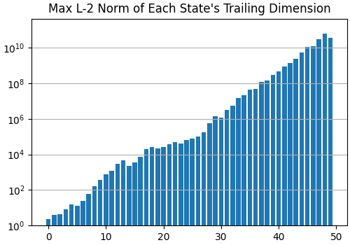
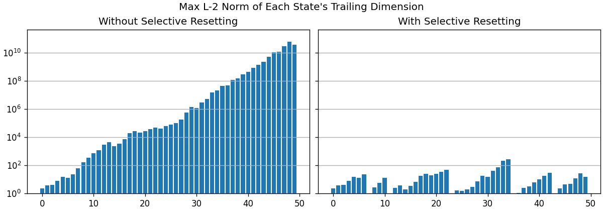

# selective_resetting

Reference implementation of the selective-resetting method for parallel prefix scans proposed in "Generalized Orders of Magnitude for Scalable, Parallel, High-Dynamic-Range Computation" (Heinsen and Kozachkov, 2025), for Pytorch. Our method enables you conditionally to reset interim states at any step in a linear recurrence, however you want to reset them, _as you compute all states in parallel via a prefix scan_.


## Installing

1. Clone this repository.

2. Install the Python dependencies in `requirements.txt`.

3. There is no third step.


## Sample Use

Our selective-resetting method applies to _any_ linear recurrence (diagonal or not, time-variant or not, over $\mathbb{R}$ or another field) computed in parallel via a prefix scan. This repository provides a reference implementation for only one case: non-diagonal linear recurrences over $\mathbb{R}$. This implementation, for PyTorch, is in a single file: [sample_implementation.py](sample_implementation.py).

We will walk through an example to show how to use our sample implementation. Launch a Python interpreter (_e.g._, in a notebook), and execute the following code to compute a non-diagonal linear recurrence $X_t = A_t X_{t-1}$, $X_0 = I$, in parallel, with a prefix scan:

```python
import torch
import torch_parallel_scan as tps

# Create sequence of random transition matrices A:
n, d = (50, 3)
A = torch.randn(n, d, d)

# Compute linear recurrence X in parallel via a prefix scan:
X_without_resets = tps.prefix_scan(A, torch.matmul, dim=-3)
```

The random vectors in each transition matrix of `A` tend to have L-2 norm greater than 1, so the L-2 norm of state vectors in `X_without_resets` will tend to increase with each additional matrix multiplication. If we plot the max vector norm within each state matrix in `X_without_resets`, using the following code,

```python
import matplotlib.pyplot as plt

fig, axis = plt.subplots(layout='constrained', figsize=(5, 3.5))
axis.set_title("Max L-2 Norm of Each State's Trailing Dimension")
axis.bar(range(n), X_without_resets.norm(dim=-1).max(dim=-1).values)
axis.set(yscale='log', ylim=(1e-1, X_without_resets.max() * 10))
axis.grid(axis='y')
```

we obtain a plot similar to this one (it won't be the same because the matrices in `A` are random):



Let's say we don't want the L-2 norms of state vectors to spiral out of control. The solution is to rescale state vectors whenever their L-2 norm starts getting too large -- say, whenever the L-2 norm exceeds 10, to keep things simple. Unfortunately, we can't do that in parallel, can we?

*Actually, yes, we can*. Our selective-resetting method allows us to reset interim states that meet a selection criteria we specify, with a reset function we specify, _in parallel, as we compute all states via a prefix scan_:

```python
from sample_implementation import ParallelizedLeftToRightRecurrenceWithSelectiveResetting

# Define non-diagonal linear recurrence with selective resetting:
parallelized_recurrence_with_sr = ParallelizedLeftToRightRecurrenceWithSelectiveResetting(
    d=d,
    select_func=lambda mats: (mats.norm(dim=-1) > 10).any(dim=-1)[..., None, None],
    reset_func=lambda mats: F.normalize(mats, dim=-1),
)

# Compute recurrence with selective resets via parallel prefix scan:
X_with_resets = parallelized_recurrence_with_sr(A)
```

If we compare the max vector norms of `X_without_resets` and `X_with_resets` with the following code,

```python
fig, axes = plt.subplots(ncols=2, sharey=True, layout='constrained', figsize=(10, 3.5))
fig.suptitle("Max L-2 Norm of Each State's Trailing Dimension")

axis = axes[0]
axis.set_title("Without Selective Resetting")
axis.bar(range(n), X_without_resets.norm(dim=-1).max(dim=-1).values)
axis.set(yscale='log', ylim=(1e-1, X_without_resets.max() * 10))
axis.grid(axis='y')

axis = axes[1]
axis.set_title("With Selective Resetting")
axis.bar(range(n), X_with_resets.norm(dim=-1).max(dim=-1).values)
axis.set(yscale='log', ylim=(1e-1, X_without_resets.max() * 10))
axis.grid(axis='y')
```

we obtain a plot similar to this one (it won't be the same because the matrices in `A` are random):



During the parallel prefix scan, whenever the norm of any vector in an interim state exceeds 10, the vectors in that state are reset to unit norm. Interim states can reach a max vector norm just below 10 without being reset, and they may be multiplied with other interim states that also reach a max vector norm just below 10, so some final compounded states may have a max vector norm that exceeds 10.

If you're interested in understanding the intuition behind our selective-resetting method, Appendix C of our paper has an informal explanation of it with step-by-step examples.


## Other Implementations

Our algorithm for parallel estimation of the spectrum of Lyapunov exponents of a dynamical system applies our selective-resetting method to prevent vector states from becoming colinear as we apply a parallel prefix scan to Jacobian matrix values, over generalized orders of magnitude (GOOMs), represented as complex tensors. Our implementation of the parallel algorithm for estimation of Lyapunov exponents is at [https://github.com/glassroom/parallel_lyapunov_exponents](https://github.com/glassroom/parallel_lyapunov_exponents).


## Citing

TODO: Update citation.

```
@misc{heinsenkozachkov2025gooms,
    title={
        Generalized Orders of Magnitude for
        Scalable, Parallel, High-Dynamic-Range Computation},
    author={Franz A. Heinsen, Leo Kozachkov},
    year={2025},
}
```


## Notes

The work here originated with casual conversations over email between us, the authors, in which we wondered if it might be possible to find a succinct expression for computing non-diagonal linear recurrences in parallel, by mapping them to the complex plane. Our casual conversations gradually evolved into the development of generalized orders of magnitude, along with an algorithm for estimating Lyapunov exponents in parallel, and a novel method for selectively resetting interim states in a parallel prefix scan.

We hope others find our work and our code useful.


